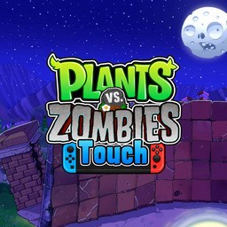

<div align="center">



# Plants vs. Zombies: Touch

**The Xbox 360 edition of Plants vs. Zombies, on Nintendo Switch** (`pvz_touch_nx`)

An unofficial Nintendo Switch wrapper for **Plants vs. Zombies TV Touch**, the
Android TV port of the console version.

[](#)
[](#)
[](#)

</div>

---

## About

`pvz_touch_nx` is a native wrapper that runs the 32-bit ARM (armeabi-v7a)
Android build of **Plants vs. Zombies TV Touch** on Nintendo Switch. It loads
the game's own engine libraries and recreates the Android, JNI, audio, input,
networking and graphics services they expect under Horizon OS. The process
runs in AArch32 mode, built with devkitARM and libnx32.

The wrapper runs its own build of the Touch mod, from the mod's GPL source,
with controller support added to every screen.

This release targets **PvZ TV Touch 1.1.5** (`com.trans.pvztv`, build 260925
or 260924, armeabi-v7a). That version exists only in Chinese. The NRO
carries the English pictures, fonts and text of **PvZTouch 4.0.5**, the
English build of the older mod, and lays them over the game.

No game code is included. You need your own copy of the APK. 

---

## Info

This is the console edition of Plants vs. Zombies, the one PopCap made for
Xbox 360 and PlayStation 3. Transmension's Android TV edition is that console
version on Android, with a harder Adventure mode, and the **Touch** mod by
ZombieYetis builds on it.

* **Two players on one console.** The Xbox 360 version's Co-op and Versus
  modes. The TV edition dropped both in an update; the Touch mod brings them
  back, and Versus also works online against Android players.
* **The Xbox 360 controls**: a cursor, seed packets on L and R, hold B to dig,
  and every sun and coin flying to the cursor with ZL or ZR.
* **The Xbox 360 pause menu**, and the Xbox version's music as an option
  (`xbox_music` in `config.ini`).
* The mod's additions on top: fast forward, a mod menu with cheats, and the
  Zombatar editor.

---

## Controls

The port uses the Xbox 360 edition's controller scheme.

| Input | On the lawn | In menus |
| --- | --- | --- |
| **Left Stick / D-Pad** | Move the cursor, collecting sun it passes | Move |
| **A** | Plant, collect | Confirm |
| **B** | Hold to dig | Back |
| **L / R** | Previous / next seed packet | Previous / next screen |
| **ZL / ZR** | Hold: every sun and coin flies to the cursor | |
| **Y** | Fast forward (2x) | |
| **-** | Power-up bar | |
| **+** | Pause | Let's Rock on the seed chooser |
| **R3** | Pointer for touch-only screens (right stick moves, ZR taps) | |
| **Touchscreen** | Tap and drag, a second finger is a second cursor | Tap |

Two controllers play the 2-player modes. Cheats and the mod menu are in
**Pause > Help & Options**.

---

## Build

### Requirements

* [android32](https://github.com/aks796/android32), the runtime this port is
  built on, at `runtime/` (a git submodule: clone with
  `--recurse-submodules`, or run `git submodule update --init`)
* Docker
* The vita2hos AArch32 toolchain image, `ghcr.io/vita2hos/devcontainer/vita2hos`
* [libnx32](https://github.com/aks796/libnx32) 4.12.0 or newer, the 32-bit libnx.
  `build.sh` mounts its `prefix/` from a libnx32 checkout next to this one
  (`../libnx32/prefix`, after its `./build.sh`), or from `DCR_LIBNX32`
* [mesa32](https://github.com/aks796/mesa32): Mesa 20.1 and libdrm_nouveau,
  with `libGLESv1_CM`. Its `lib/` and `include/` go into `portlibs32/`
* [ffmpeg32](https://github.com/aks796/ffmpeg32), built with the mov demuxer
  and the MPEG-4 and AAC decoders (its default). Its `lib/` and `include/`
  go into `portlibs32/` too
* Android NDK r27d, for the mod
* Python 3 with Pillow, numpy and pyelftools, for the tools and checks

Put mesa32 and ffmpeg32 in `portlibs32/`, from their release tarballs or
their `prefix/` folders:

```bash
mkdir -p portlibs32
cp -r /path/to/mesa32/prefix/* /path/to/ffmpeg32/prefix/* portlibs32/
```

Build the mod, the wrapper and the launcher:

```bash
ANDROID_NDK=/path/to/android-ndk-r27d mod/build_mod.sh
DCR_LIBNX32=/path/to/libnx32/prefix ./build.sh
launcher/build.sh
```

This gives `pvz_nx.nsp` (the 32-bit game program) and
`launcher/pvz_touch_nx.nro`, which carries it.

To build everything, run the host checks and lay out an SD card in `SD_CARD/`:

```bash
tools/package_sd.sh /path/to/game.apk /path/to/english.apk
```

The APKs are optional. When given, the checks run against them and the game
APK is copied into `SD_CARD/`. The English APK is cut down to the files the
port reads (`tools/make_english_pack.py`, about 21 MB) into
`../english_pack/`, outside the project, and built into the NRO.
`launcher/build.sh` takes the pack from there, or from `PVZ_ENGLISH_PACK`.
Without one, the NRO is built without English pictures.

---

## Running

You need Atmosphère and sphaira.

Create this folder on the SD card and put the NRO and your APK in it:

```text
sd:/switch/pvz_touch_nx/
├── pvz_touch_nx.nro
└── PvZ-TV-v1.1.5-260925-release.apk
```

The file name does not matter as long as it ends in `.apk`.

1. In sphaira, open **Homebrew > Plants vs. Zombies: Touch** and choose
   **Install Forwarder**.
2. Launch the new icon on the HOME menu. The launcher installs the 32-bit game
   program for that icon and restarts it.
3. The first start unpacks the game's libraries, copies the English files out
   of the NRO and makes the English layer, with a progress bar on screen.
   This takes about half a minute.

An English APK of your own (PvZTouch 4.0.5 or RedStr1x, any file name) in the
folder is used instead of the NRO's English files.

Afterwards the folder looks like this:

```text
sd:/switch/pvz_touch_nx/
├── pvz_touch_nx.nro
├── PvZ-TV-v1.1.5-260925-release.apk
├── PvZ Touch English.apk  the English files, from the NRO
├── config.ini
├── libnative_code.so
├── libGameMain.so
├── libHomura.so
├── classes.txt
├── data/files/            saves in userdata/, the English layer
├── external/
└── debug.log
```

To update, replace `pvz_touch_nx.nro` and launch the icon. The game installs
the newer build itself and restarts.

Releases before this one used `sd:/switch/pvztouch/` and `PvZTouch.nro`. The
first start moves everything from that folder into `sd:/switch/pvz_touch_nx/`
and leaves only the old NRO behind. To keep your existing icon, copy
`pvz_touch_nx.nro` into the old folder and launch it once.

Settings live in `config.ini`, which is written on the first launch and
explains each option in place.

---

## Status

Tested on hardware.

Working: the whole game in English, controllers and touch, local VS and
co-op, online VS against Android players on the same mod build (protocol
3199), the intro video, and saves.

The engine's original online services (Transmension's servers) no longer
exist and stay offline. The power-ups those servers sold are free here.

Ryujinx runs setup and loading, then stops when the mod starts because it
lacks some 32-bit instructions.

---

## Credits

**Plants vs. Zombies: Touch Nintendo Switch port**: aks796

**Plants vs. Zombies**: PopCap Games. Android TV edition: Transmension.

**PvZ TV Touch mod** (libHomura, the mod menu, online VS): ZombieYetis and
the PvZ TV Touch Team,
[github.com/ZombieYetis/PlantsVsZombies-AndroidTV](https://github.com/ZombieYetis/PlantsVsZombies-AndroidTV),
GPL-3.0. Its source, with this port's changes, is in `mod/`. Online rooms are
hosted by the mod's relay servers
([PvZ-TV-Server](https://github.com/ZombieYetis/PvZ-TV-Server)).

The English text and art come from the English PvZ TV Touch builds (4.0.5 and
RedStr1x) and their translators.

The loader derives from the open-source Switch `.so` loader work by Andy
Nguyen (TheOfficialFloW) and fgsfds, and from vita2hos by xerpi. It was forked
from this author's Disney Crossy Road wrapper.

Built with devkitPro, devkitARM, libnx32, Mesa, libdrm_nouveau, FFmpeg (LGPL)
and miniz. Button pictures are drawn with the DejaVu fonts.

This port's code is MIT-licensed, see `LICENSE`. The mod in `mod/` is GPL-3.0,
see `mod/LICENSE`, and the NRO carries a build of it.

---

## Contributing

Bug reports and tested improvements are welcome. Include the build number (on
the launcher screen and at the top of `debug.log`), steps to reproduce, and
`debug.log` from the game folder. If the game closed by itself, include
`crash.log` and the newest report in `sd:/atmosphere/crash_reports/` as well.

Technical notes on the port and on the 32-bit libraries are in `NOTES.md`.

---

## Disclaimer

This is an unofficial fan project and is not affiliated with, sponsored by or
endorsed by Nintendo, Electronic Arts, PopCap Games or Transmension. Plants
vs. Zombies and all related names and trademarks belong to Electronic Arts.

The NRO includes the English pictures, fonts and text of the fan-made English
build (PvZTouch 4.0.5). No game code is included, and the repository holds no
game files. You need your own copy of the game's APK.
